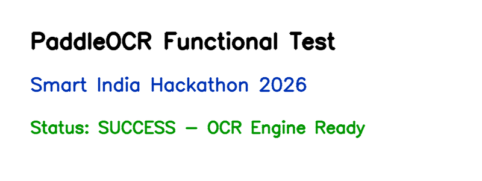

# SIH 2026 — Intelligent OCR Web Application

An intelligent, full-stack text extraction web application powered by **PaddleOCR (PP-OCRv4)** and **PaddlePaddle 3.0**. Built for high-accuracy multilingual OCR processing.



---

## ✨ Features

- 🔍 **Multilingual OCR Engine**: Powered by PaddleOCR PP-OCRv4 with support for 80+ languages (English, Hindi, Tamil, Telugu, Chinese, Japanese, etc.).
- 🎨 **Modern Dark Glassmorphism UI**: Beautiful, responsive web interface built with Vanilla CSS & HTML5.
- 📤 **Drag & Drop Uploads**: Support for images (PNG, JPG, BMP, TIFF) up to 20MB.
- 🎯 **Bounding Polygon Visualization**: Real-time visual feedback with confidence-based color coding (Green: >90%, Cyan: >70%, Red: <70%).
- 📊 **Metrics & Analytics**: Live stats showing total lines detected, average confidence score, and processing latency.
- 📋 **Copy to Clipboard**: Quick single-click export of all extracted text.
- ⚡ **REST API Endpoint (`POST /ocr`)**: Clean JSON response for integration into pipelines.

---

## 🚀 Quick Start

### 1. Prerequisites
- Python 3.8+ (64-bit)
- `pip`

### 2. Installation

Clone the repository and install dependencies:

```bash
git clone https://github.com/pbanirudh/SIH-2026.git
cd SIH-2026

# Install PaddlePaddle CPU
pip install paddlepaddle==3.0.0

# Install PaddleOCR package
cd PaddleOCR-main/PaddleOCR-main
SETUPTOOLS_SCM_PRETEND_VERSION="3.0.0" pip install .
cd ../..

# Install web dependencies
pip install flask opencv-python Pillow
```

### 3. Run the Web Application

```bash
python app.py
```

Open your browser and navigate to:
👉 **`http://localhost:5000`**

---

## 📁 Repository Structure

```
SIH-2026/
├── app.py                  # Flask Web Server & OCR API Backend
├── templates/
│   └── index.html          # Frontend HTML Layout
├── static/
│   ├── style.css           # Glassmorphism Design System & Styles
│   └── script.js           # Client-Side Drag-and-Drop & AJAX Logic
├── test_images/            # Sample Test Images
├── PaddleOCR-main/         # PaddleOCR Core Source Repository
├── test_ocr.py             # CLI Verification Script
└── generate_test_img.py    # Test Image Generator Script
```

---

## 🧪 Testing

To test PaddleOCR via CLI:
```bash
python test_ocr.py
```
