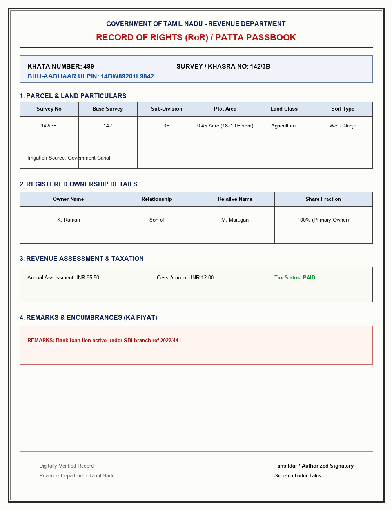

# SIH 2026 — Indian Land Document Generator & Intelligence Engine

An end-to-end intelligent land record processing application powered by **PaddleOCR (PP-OCRv4)** and **PaddlePaddle 3.0**. Includes a synthetic land document image generator and schema-aware classifier for standard Indian land records.



---

## ✨ Key Features

1. **🛠️ Synthetic Land Document Generator**:
   Generates official-looking rendered synthetic land document images for 4 standard schema types:
   - **1. Record of Rights (RoR / Patta / 7/12 / Jamabandi / Khatauni)**: Khata No, Khasra/Survey No, ULPIN, Plot Area, Land Classification, Soil Type, Ownership, Revenue & Lien Remarks.
   - **2. Conveyance & Transfer Deeds (Sale Deed)**: Deed Type, Reg No, SRO Office, Sellers, Buyers, Financial Consideration, Property Schedule & 4 Boundaries.
   - **3. Mutation Register & Orders (Dakhil-Kharij / VF-6)**: Mutation Serial No, Case Ref, Nature, Sanctioned Date, Prior & New Owner, Sanctioning Authority.
   - **4. Spatial Cadastral Map (Bhu-Naksha / FMB)**: Map Sheet, Projection EPSG, Khasra Polygon Geometry, GIS Area, Centroid Lat/Long, Tie Line Measurements.

2. **🧠 Schema-Aware OCR Classifier & Extractor**:
   - Classifies uploaded document images into one of the 4 standard document schemas with confidence metrics.
   - Automatically extracts structured JSON matching exact government field specifications.

3. **🎨 Glassmorphism Web Interface**:
   - **Upload Mode**: Drag & drop official documents for instant OCR & structured JSON extraction.
   - **Generator Mode**: Choose document standards or edit custom JSON payloads, generate realistic documents, and run OCR with 1 click.
   - **Interactive Results**: Switch between **Structured JSON Schema View** and **Raw OCR Line View**.

---

## 🚀 Quick Start

### 1. Prerequisites
- Python 3.8+ (64-bit)

### 2. Installation & Running

```bash
git clone https://github.com/pbanirudh/SIH-2026.git
cd SIH-2026

# Install PaddlePaddle & PaddleOCR
pip install paddlepaddle==3.0.0
cd PaddleOCR-main/PaddleOCR-main
SETUPTOOLS_SCM_PRETEND_VERSION="3.0.0" pip install .
cd ../..

# Install web dependencies
pip install flask opencv-python Pillow

# Start the web server
python app.py
```

Open your browser at:
👉 **`http://localhost:5000`**

---

## 📁 Repository Structure

```
SIH-2026/
├── app.py                      # Flask Server, OCR API, & Generator Endpoints
├── document_generator.py       # Synthetic Image Renderer (RoR, Deed, Mutation, FMB Map)
├── document_parser.py          # Document Classifier & Structured JSON Extractor
├── test_document_parser.py     # End-to-End Verification Test Script
├── templates/
│   └── index.html              # Web Interface HTML Layout
├── static/
│   ├── style.css               # Glassmorphism Styling & CSS Tokens
│   └── script.js               # Client-Side Generator & Tab Switching Logic
├── test_images/                # Sample Document Images for all 4 Schemas
└── PaddleOCR-main/             # PaddleOCR Engine Core Source
```
